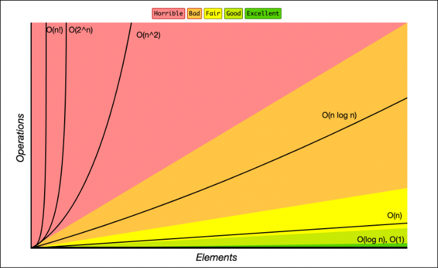

# Apunts onzena classe PRO1

## Introducció a la Notació Big O
La Notació Big O s'utilitza en informàtica per descriure el rendiment o la complexitat d'un algorisme. Específicament, descriu el pitjor dels casos i ens ajuda a entendre com creix el temps d'execució (o l'ús de memòria) a mesura que augmenta la mida de les dades d'entrada ($n$).

<figure>
    
    <figcaption>Font de la imatge: Frecodecamp Big O Cheat Sheet </figcaption>
</figure>


### Per què és important?
- Eficiència: Ens permet comparar dos algorismes més enllà del maquinari on s'executin.
- Escalabilitat: Ajuda a predir si un programa fallarà o anirà massa lent quan les dades creixin significativament.

### Tipus comuns de complexitat
A continuació es detallen les complexitats més habituals ordenades de la més eficient a la menys eficient:

| Tipus | Símbol | Explicació | Exemple| Rendiment |
|--------------|--------------|--------------|---|-| 
|Constant | $O(1)$ | L'algorisme triga sempre el mateix temps, independentment de la mida de l'entrada | Accedir a un element d'un vector mitjançant el seu índex |Excel·lent |
| Logarítmica | $O(\log n)$ | El temps d'execució creix de manera logarítmica. Normalment apareix en algorismes que divideixen el problema per la meitat en cada pas | Exemple: Cerca binària en un vector ordenat |Molt bo |
|Lineal | $O(n)$ | El temps d'execució creix de manera directament proporcional a la mida de l'entrada | Exemple: Un bucle for simple que recorre tots els elements d'una llista|Bo / Acceptable |
| Log-lineal | $O(n \log n)$ | És la complexitat típica dels algorismes d'ordenació eficients | sort() de la biblioteca estàndard de C++, Merge Sort o Quick Sort |Acceptable |
| Quadràtica | $O(n^2)$ | El temps d'execució creix proporcionalment al quadrat de l'entrada. Molt comú quan tenim bucles niats. | Comparar cada element d'una llista amb tots els altres elements de la mateixa llista |Dolent |
| Exponencial | $O(2^n)$ | El creixement és extremadament ràpid. S'ha d'evitar per a entrades grans | Exemple: Càlcul recursiu "ingenu" de la sèrie de Fibonacci | Molt dolent |

## Alguns exemples
###  $O(n)$ - Cerca linealC++

```c++
bool cerca_lineal(int vector[], int n, int element) {
    for (int i = 0; i < n; ++i) { // Recorrem n elements
        if (vector[i] == element) return true;
    }
    return false;
}
```

### Exemple $O(n^2)$ - Bucles niuats
```c++
void imprimir_parelles(int n) {
    for (int i = 0; i < n; ++i) {       // Bucle extern
        for (int j = 0; j < n; ++j) {   // Bucle intern
            cout << i << ", " << j << endl;
        }
    }
}
```

### Exemple $O(\log n)$ - Cerca binària (Idea general)

```c++
int cerca_binaria(int arr[], int esquerra, int dreta, int x) {
    while (esquerra <= dreta) {
        int mig = esquerra + (dreta - esquerra) / 2;
        if (arr[mig] == x) return mig;
        if (arr[mig] < x) esquerra = mig + 1;
        else dreta = mig - 1;
    }
    return -1;
}
```

## Regles d'or per calcular la Big O
Ens quedem amb el terme dominant: Si un algorisme és $O(n^2 + n)$, diem que és $O(n^2)$.Ignorem les constants: $O(2n)$ es simplifica a $O(n)$.Pitjor dels casos: Sempre analitzem l'escenari on l'algorisme triga més (per exemple, si busquem un element i aquest és l'últim de la llista).

### Conceptes avançats per a l'anàlisi
#### Crides a altres funcions
Quan una funció en crida una altra dins d'un bucle, les complexitats es multipliquen.
```c++
// Si la funció 'es_primer' és O(sqrt(n))
// Aquesta funció total serà O(n * sqrt(n))
void llista_primers(int n) {
    for (int i = 2; i <= n; ++i) {
        if (es_primer(i)) cout << i << endl;
    }
}
```
#### Complexitat Espacial (Memòria)
A part del temps, la Big O també mesura quanta memòria extra fem servir.
* O(1) espacial: Si només fem servir unes poques variables auxiliars.
* O(n) espacial: Si creem un vector de mida $n$.

## Taula de creixement (Per què evitem $O(n^2)$)

Aquesta taula ajuda a visualitzar per què ens esforcem a optimitzar els algorismes:

| $n$ | $O(\log n)$ | $O(n)$ | $O(n \log n)$ | $O(n^2)$ |
| :--- | :--- | :--- | :--- | :--- |
| **10** | ~3 op. | 10 op. | ~33 op. | 100 op. |
| **100** | ~7 op. | 100 op. | ~664 op. | 10.000 op. |
| **1.000** | ~10 op. | 1.000 op. | ~10.000 op. | 1.000.000 op. |
| **1.000.000** | ~20 op. | 1.000.000 op. | ~20.000.000 op. | $10^{12}$ (massa lent!) |


## Qüestionari: Quina és la Big O?
Respon quina és la complexitat temporal en el pitjor dels casos per a cadascun dels següents fragments de codi o situacions.

---

1. Accés directe

	```c++
	int obtenir_element(int vector[], int i) {
		return vector[i];
	}

	```
	• a) $O(n)$

	• b) $O(1)$

	• c) $O(\log n)$ 
	
	Resposta: b) $O(1)$. L'accés a una posició de memòria d'un vector és immediat.

2. Bucle simple

	```c++
	int suma = 0;
	for (int i = 0; i < n; ++i) {
		suma += i;
	}
	```
	• a) $O(n)$

	• b) $O(n^2)$

	• c) $O(1)$ 

	Resposta: a) $O(n)$. El bucle s'executa exactament $n$ vegades.

3. Bucles niuats

	```c++
	for (int i = 0; i < n; ++i) {
		for (int j = 0; j < n; ++j) {
			cout << i << j << endl;
		}
	}
	```

	• a) $O(2n)$

	• b) $O(n \log n)$

	• c) $O(n^2)$ 

	Resposta: c) $O(n^2)$. Per cada iteració del bucle extern, el bucle intern es fa $n$ vegades ($n \times n$).

4. Bucle amb divisió (Cerca logarítmica)

	```c++
	int i = n;
	while (i > 1) {
		i /= 2;
	}
	```
	• a) $O(\log n)$

	• b) $O(n)$

	• c) $O(n \log n)$ 

	Resposta: a) $O(\log n)$. Dividir la mida del problema per la meitat en cada pas genera una corba logarítmica.

5. Cerca **lineal** en un vector no ordenat

	Si busquem **linealment** un element `x` en un vector de mida `n` que no sabem si està ordenat:

	• a) $O(1)$

	• b) $O(n)$

	• c) $O(\log n)$ 

	Resposta: b) $O(n)$. En el pitjor cas, l'element és l'últim o no hi és.

6. Dos bucles independents

	```c++
	for (int i = 0; i < n; ++i) {
		// fer alguna cosa O(1)
	}
	for (int j = 0; j < n; ++j) {
		// fer alguna cosa O(1)
	}
	```
	• a) $O(n^2)$

	• b) $O(n)$

	• c) $O(2^n)$ 

	Resposta: b) $O(n)$. Les complexitats se sumen ($n + n = 2n$), i s'ignoren les constants.

7. Bucle amb crida a funció

	```c++
	// Suposant que 'cerca_binaria' és O(log n)
	for (int i = 0; i < n; ++i) {
		cerca_binaria(vector, n, i);
	}
	```

	• a) $O(n \log n)$

	• b) $O(n + \log n)$

	• c) $O(n)$ 

	Resposta: a) $O(n \log n)$. Executem una operació logarítmica dins d'un bucle lineal.

8. El mètode `sort()` de la llibreria estàndard

	La majoria d'implementacions de `std::sort` en C++ tenen una complexitat de:

	• a) $O(n^2)$

	• b) $O(n \log n)$

	• c) $O(n)$ 
	
	Resposta: b) $O(n \log n)$. És la complexitat mitjana i en el pitjor cas de l'algorisme IntroSort que fa servir C++.

9. Fibonacci recursiu "ingenu"

	```c++
	int fib(int n) {
		if (n <= 1) return n;
		return fib(n-1) + fib(n-2);
	}

	```
	• a) $O(n^2)$

	• b) $O(n \log n)$

	• c) $O(2^n)$ 

	Resposta: c) $O(2^n)$. Cada crida genera dues crides més, fent que l'arbre d'execució creixi exponencialment.

10. Matriu quadrada

	Volem omplir una matriu de mida $n \times n$:

	• a) $O(n)$

	• b) $O(n^2)$

	• c) $O(n^3)$ 
	
	Resposta: b) $O(n^2)$. S'han de visitar $n \times n$ posicions de memòria.

Alguna de les fonts consultades són [FreecodeCamp Big O notation][1]

[1]: https://www.freecodecamp.org/news/big-o-cheat-sheet-time-complexity-chart/

Alexandre Gràcia Calvo
